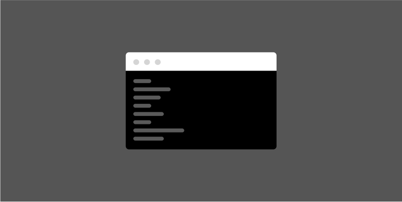

# Development

**The key to successful collaboration between developers and designers is continuous communication, mutual respect, and a shared understanding of the project objectives.**

Our collaborative approach ensures that the Design System you’re building is both visually appealing and technically sound. We outline things like: token naming conventions, handoff specifications, collaboration and creation checklists, to name a few – to allow for the smoothest way of working.

## Watch the demo

## Resources

Take a peek under the hood and see some of the resources Radius has to offer.

**Foundations**

Explore how we implement tokens in Radius.

**Storybook**

Lorem ipsum dolor sit amet, consectetur adipiscing elit, sed do eiusmod tempor.

**Product Files**

Lorem ipsum dolor sit amet, consectetur adipiscing elit, sed do eiusmod tempor.

**UI Kit**

Lorem ipsum dolor sit amet, consectetur adipiscing elit, sed do eiusmod tempor.

Back: [Process](process.md) | Next: [Design](design.md)