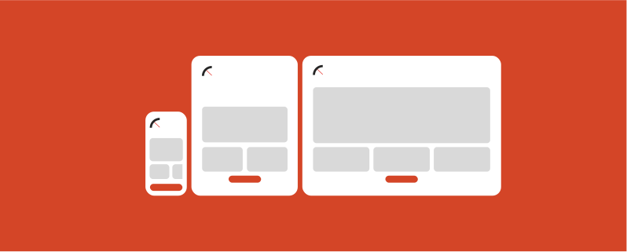
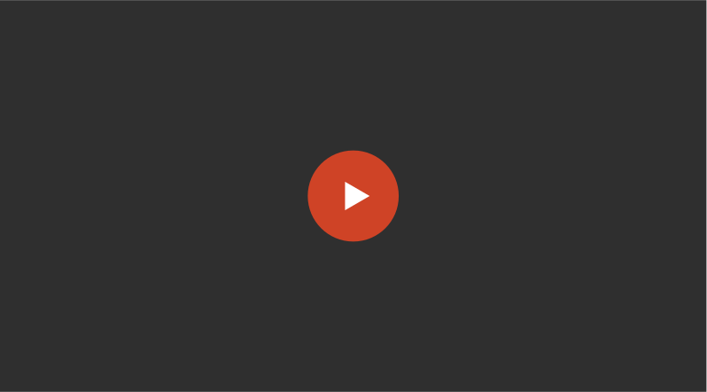

# Isomorphic layouts

**Want to create a one-off landing page? That is due on a specific day? That needs to satisfy the marketing team?** 

Transferring complex layouts to different screen sizes takes a lot of time due to specifications and clarifications, but using a common language and structures helps everyone understand and validate the required tasks more effectively. Let's explore a scenario to see how it all comes together.

## Watch the demo

**Foundations**

Explore how we implement tokens in Radius.

**Storybook**

Lorem ipsum dolor sit amet, consectetur adipiscing elit, sed do eiusmod tempor.

**Product Files**

Lorem ipsum dolor sit amet, consectetur adipiscing elit, sed do eiusmod tempor.

**UI Kit**

Lorem ipsum dolor sit amet, consectetur adipiscing elit, sed do eiusmod tempor.

Back: [Design Context as Code](design-context-as-code.md) | Next: [360˚ Components](360-components.md)
