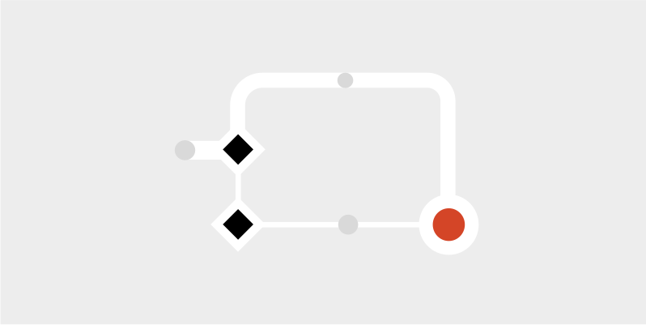

# Process

**Our process enhances alignment between your Design System team and Product teams. We'll guide you on collaborating effectively with the Design System team, involving the right roles at the right time, managing unique components, gathering feedback, and more!**

Our collaborative approach ensures that the Design System you’re building is both visually appealing and technically sound. We outline things like: token naming conventions, handoff specifications, collaboration and creation checklists, to name a few – to allow for the smoothest way of working.

## Watch the demo

## Resources

Take a peek under the hood and see some of the resources Radius has to offer.

**Foundations**

Explore how we implement tokens in Radius.

**Storybook**

Lorem ipsum dolor sit amet, consectetur adipiscing elit, sed do eiusmod tempor.

**Product Files**

Lorem ipsum dolor sit amet, consectetur adipiscing elit, sed do eiusmod tempor.

**UI Kit**

Lorem ipsum dolor sit amet, consectetur adipiscing elit, sed do eiusmod tempor.

Back: [360˚ components](360-components.md) | Next: [Development](development.md)