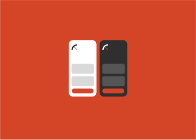
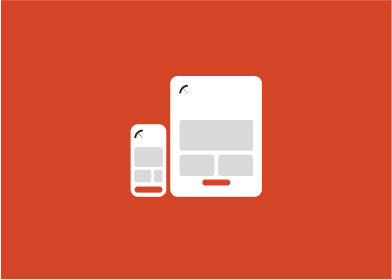
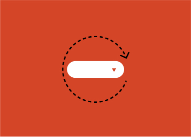
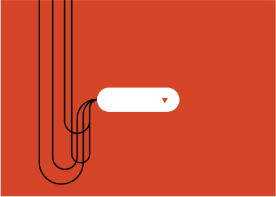
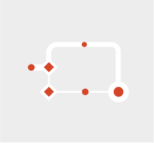
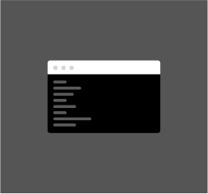

# What is Radius?

#### Radius is an ecosystem of resources needed to accelerate any design system. It’s not a design system, but a customizable foundation for one. 

Our goal is to enable teams with powerful and user-friendly tools that supercharge the creation of their own design system, enabling seamless collaboration, impeccable organization, and swift product release. By streamlining and energizing the process, we make adopting our solution a 
"no-brainer," igniting teams' boundless creativity and turbocharging their productivity.

## Features

Design context as code

Isomorphic layouts

360˚ components

Tracker

## Resources

**Process**

From governance to creating components, explore our approach.

**Development**

From to tokens to tracking component performance explore our approach.

**Design**

From tokens to icons to getting organized, explore our approach.

# Learning. Curved.

Design Systems are a new way of working. 

Finding your flow may take some time, but rest assured, we'll be readily available to support you at any capacity. Our commitment lies in the "teach a man to fish" philosophy. Our goal is to equip you with the knowledge to thrive well beyond our time together. Our journey will be educational, inspirational, and transformational. Let’s chat

Next: [Design Context as Code](design-context-as-code.md)
