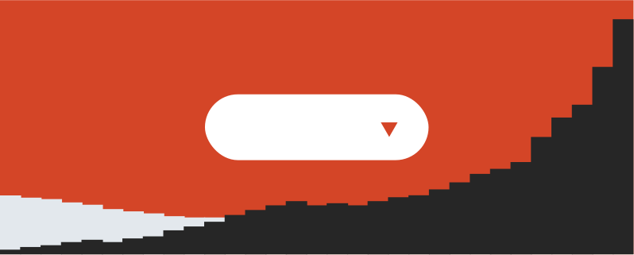

# Tracker

**Track every use of every component in every code base in your company**

Radius Tracker generates reports measuring design system adoption, calculated bottom-up from individual component usage stats automatically collected from your organization repositories.

## Watch the demo

## Resources

Take a peek under the hood and see some of the resources Radius has to offer.

**Foundations**

Explore how we implement tokens in Radius.

**Storybook**

Lorem ipsum dolor sit amet, consectetur adipiscing elit, sed do eiusmod tempor.

**Product Files**

Lorem ipsum dolor sit amet, consectetur adipiscing elit, sed do eiusmod tempor.

**UI Kit**

Lorem ipsum dolor sit amet, consectetur adipiscing elit, sed do eiusmod tempor.

Back: [Isomorphic Layouts](isomorphic-layouts.md) | Next: [Tracker](traker.md)